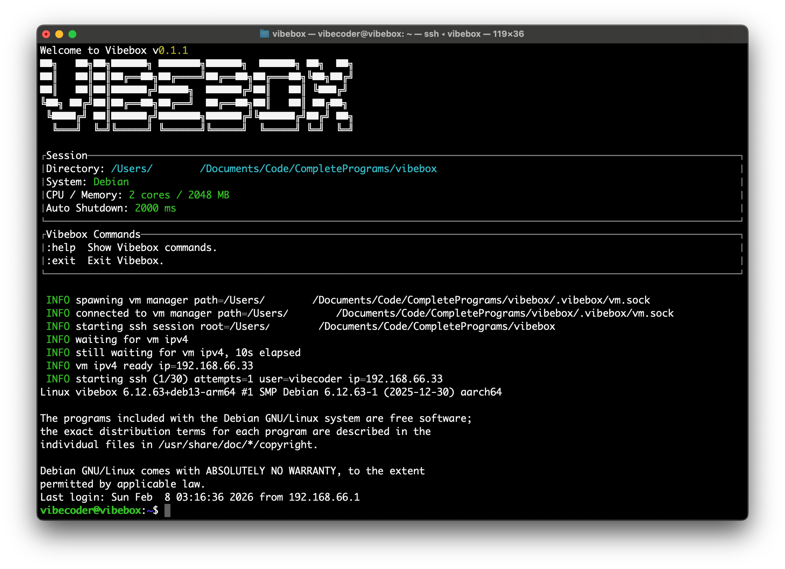

<p align="center">
  <a href="https://vibebox.robcholz.com">
    <picture>
      
    </picture>
  </a>
</p>
<p align="center">The open source AI coding agent.</p>

[![Crates.io][crates-badge]][crates-url]
[![MIT licensed][mit-badge]][mit-url]
[![Build Status][actions-badge]][actions-url]

[crates-badge]: https://img.shields.io/crates/v/vibebox.svg

[crates-url]: https://crates.io/crates/vibebox

[mit-badge]: https://img.shields.io/badge/license-MIT-blue.svg

[mit-url]: https://github.com/robcholz/vibebox/blob/main/LICENSE

[actions-badge]: https://github.com/robcholz/vibebox/workflows/CI/badge.svg

[actions-url]: https://github.com/robcholz/vibebox/actions?query=workflow%3ACI+branch%3Amain

<p align="center">
  <a href="README.md">English</a> |
  <a href="README.zh.md">简体中文</a> |
</p>

[](https://vibebox.robcholz.com)

---

### Installation

```bash
# YOLO
curl -fsSL https://raw.githubusercontent.com/robcholz/vibebox/main/install | bash

# Package managers
cargo install vibebox
```

> [!TIP]
> We truly recommend you to use `YOLO`.

todo

### Documentation

todo

### Contributing

If you're interested in contributing to VibeBox, please read our [contributing docs](CONTRIBUTING.md) before
submitting a pull request.

### Using VibeBox

Feel free to use, but remember to promote VibeBox as well!

### FAQ

#### How is this different from other Sandboxes?

Vibebox is built for fast, repeatable local sandboxes with minimal ceremony. What’s different here:

- Warm startup is typically under **6 seconds** on my M3, so you can jump back in quickly.
- One simple command — `vibebox` — drops you into the sandbox from your project.
- Configuration lives in `vibebox.toml`, where you can set CPU, RAM, disk size, and mounts.

### Special Thank

[vibe](https://github.com/lynaghk/vibe) by lynaghk.

And amazing Rust community, without your rich crates and fantastic toolchain like [crates.io](https://crates.io), this
wouldn't be possible!

---

**Follow me on X** [X.com](https://x.com/robcholz)
